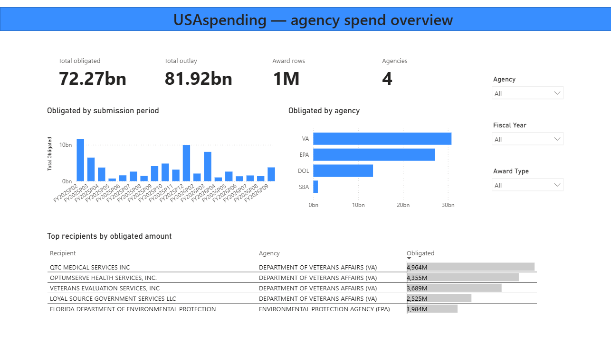
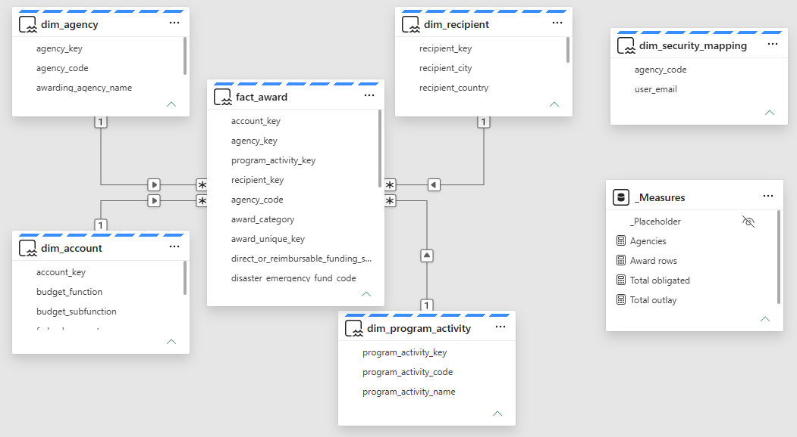
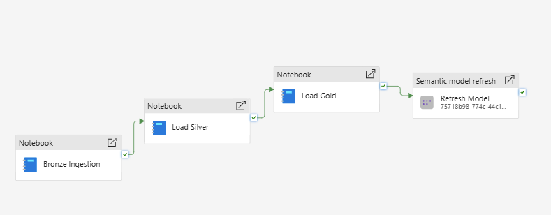

# USAspending Accounting Analytics — End-to-End Microsoft Fabric Platform

> **🎯 Business Question:** Can each federal agency's spend, obligations, and top recipients be tracked accurately and refreshed automatically — while ensuring each agency's analysts can only ever see their own agency's data?

An end-to-end data analytics platform built on **Microsoft Fabric** — from raw USAspending.gov CSV exports to an interactive Power BI dashboard — using the **Medallion architecture** (Bronze → Silver → Gold), a Direct Lake semantic model with native Row-Level Security, and a scheduled, self-refreshing pipeline.

Treated as production data: a naive merge key silently collapsed real transaction rows, "duplicate" rows turned out to be legitimate distinct records, and ~60% of one financial measure being NULL was investigated down to the raw CSV rather than assumed to be a bug. Nothing here was taken at face value.

---

## 📊 Dashboard

### Agency Spend Overview



- **How much has each agency obligated and paid out, and how do the four agencies compare?** — Total Obligated, Total Outlay, Award Rows, and Agency Count as unified KPIs, with a per-agency obligated-amount comparison chart
- **How does spend trend across the fiscal year?** — Submission-period trend chart, ordered chronologically
- **Who are the largest recipients of federal awards, and which agency funds them?** — Top-recipients table, joined across the `dim_recipient` and `dim_agency` relationship
- **Can an agency's analyst see only their own agency's data?** — Verified with a real Viewer-level account under Row-Level Security (see below) — not just a design claim

---

## 🏗 Architecture

**Dataset:** USAspending.gov, File C (Account Breakdown by Award) — 4 federal agencies (SBA, EPA, DOL, VA), 2 award categories (assistance, contracts), ~937K rows across Bronze.

**Tech Stack:** Microsoft Fabric · Lakehouse · PySpark · Delta Lake `MERGE` · T-SQL (Warehouse variant) · Power BI (Direct Lake) · DAX · Row-Level Security · Data Pipelines

```
Raw CSV Exports (USAspending.gov, File C)
    |
    v

  BRONZE            SILVER              GOLD
  Lakehouse   --->  Lakehouse   --->    Lakehouse
  (raw, typed,      (cleaned,           (star schema:
   watermarked)      deduplicated,       4 conformed dims
                      watermarked)        + fact_award,
                                          surrogate keys,
                                          RLS mapping table)
                                                |
                                                v
                                       Semantic Model
                                       (Direct Lake, DAX,
                                        Row-Level Security)
                                                |
                                                v
                                       Power BI Dashboard

   All three layers orchestrated by one Fabric Data Pipeline,
   scheduled nightly, finishing with an explicit semantic
   model reframe so Direct Lake reflects the new data.
```

**Why three watermark columns, not one?** Each layer boundary needs its own "what's new since I last checked" signal — `_bronze_load_ts` (raw → Bronze), `_silver_load_ts` (Bronze → Silver), and Gold's own `gold_watermark` control table (Silver → Gold). Reusing one upstream timestamp across layers breaks the moment two layers run on different schedules or at different speeds.

---

## 🗂 Data Model (Star Schema)



One fact table (`fact_award`) at *award/account/period/object-class* grain, four conformed dimensions with deterministic surrogate keys:

| Table | Grain / Business key |
|---|---|
| `fact_award` | 10-column composite business key (see below) + `award_category` |
| `dim_agency` | `agency_code` |
| `dim_account` | `federal_account_symbol` |
| `dim_program_activity` | `(program_activity_code, program_activity_name)` — composite, see Data Engineering Challenges |
| `dim_recipient` | `recipient_uei` |
| `dim_security_mapping` | Unrelated to the model — referenced only via `LOOKUPVALUE()` inside the RLS rule, deliberately not joined |

Every dimension carries an explicit **`-1` "Unknown" member**, so fact rows with a genuinely missing business key (confirmed real, not a bug) resolve to a visible "Unknown" bucket in Direct Lake visuals instead of silently vanishing.

---

## 🔐 Row-Level Security

**Design:** `dim_security_mapping` maps a user's login (`user_email`) to an `agency_code`, with `"ALL"` reserved for unrestricted admin access. A DAX role (`AgencyAnalyst`) filters `dim_agency`:

```dax
[agency_code] = LOOKUPVALUE(dim_security_mapping[agency_code], dim_security_mapping[user_email], USERPRINCIPALNAME())
|| LOOKUPVALUE(dim_security_mapping[agency_code], dim_security_mapping[user_email], USERPRINCIPALNAME()) = "ALL"
```

Because `dim_agency` has a modeled relationship to `fact_award`, restricting the dimension automatically restricts every fact row through normal filter propagation — no separate rule needed on the fact table itself.

**A platform limitation worth documenting, not hiding:** Direct Lake connections use Single Sign-On (SSO), and Power BI's built-in testing shortcuts — `View as Role` in Desktop and `Test as role` in the Service — do not work against SSO-based connections. This isn't a bug in this project; it's documented Power BI behavior. RLS was verified end-to-end using a genuine Viewer-level account instead, since Editors/Admins are exempt from RLS by design (Power BI's safeguard against accidental self-lockout).

---

## 🔍 Data Engineering & Quality Challenges

Three separate correctness bugs were found and fixed by reconciling numbers at every layer boundary, not by assuming the pipeline was correct because it ran without error.

### The 17-row collision

A 5-column key (`award_unique_key`, `federal_account_symbol`, `program_activity_code`, `object_class_code`, `submission_period`) was assumed to uniquely identify a row. Investigation proved otherwise: the same combination described **17 real, distinct transaction lines**, with different `program_activity_name` values and different `transaction_obligated_amount` values. Root cause: `program_activity_reporting_key` (a natural disambiguator) is frequently blank in the source. Fixed by widening the key to 10 verified, collision-free columns — confirmed via `COUNT(*) = COUNT(DISTINCT <10 columns>)` returning zero collisions on both the assistance and contracts tables.

### The reversed row-count/total-amount signal

An earlier, narrower key caused `dropDuplicates()` to silently discard real transaction rows. This was caught not by row counts but by a financial reconciliation check: Silver's `SUM(transaction_obligated_amount)` came out **higher** than Bronze's ($30,879,891,919.68 vs $30,862,858,239.91) despite Silver having **fewer** rows — only possible if the discarded rows carried negative or smaller values than the rows kept. This one inverted signal (fewer rows, higher total) was the tell that "duplicates" were actually distinct records, not copies.

### The composite dimension key

`dim_program_activity` was initially deduplicated on `program_activity_code` alone. Investigation (via `COUNT(DISTINCT program_activity_name)` grouped by code) confirmed the same code can legitimately pair with multiple different names. Fixed by widening the dimension's key to `(code, name)` together, joined into the fact table on both columns.

### The NULL that wasn't a bug

~55–68% of rows report `transaction_obligated_amount` as NULL. Rather than assume a casting failure, the raw CSV was inspected directly (bypassing Bronze/Silver entirely, `inferSchema=false`) — confirming `NULL` is a genuine value in the source file itself, alongside cleanly-formatted numbers with no parsing artifacts. This reflects real reporting behavior (a period/account slice with no new obligation activity), not a pipeline defect.

### CSV structural integrity

Free-text description fields (e.g. `prime_award_base_transaction_description`) contain embedded commas, quotes, and line breaks, which shifted column values across rows under default CSV parsing. Fixed with explicit `quote`, `escape`, and `multiLine` Spark read options.

---

## ⚡ Direct Lake Engineering Notes

**No calculated columns in Direct Lake.** Fields needed for the report — `fiscal_year` (formatted `FY2025`, matching USAspending's own convention, since the U.S. federal fiscal year runs October–September and doesn't align with the calendar year) and a numeric period-sort column — were computed upstream in the Gold PySpark notebook rather than as DAX calculated columns, which Direct Lake does not support.

**Surrogate keys, deliberately not `monotonically_increasing_id()`.** That function's output isn't stable across separate Spark jobs, risking key collisions between incremental runs. Surrogate keys are instead computed as `(current max existing key) + row_number() over new rows only` — deterministic and collision-safe regardless of how many times a load re-runs.

---

## 🔁 Pipeline Automation



```
Bronze Notebook  --(on success)-->  Silver Notebook  --(on success)-->  Gold Notebook  --(on success)-->  Semantic Model Refresh
```

Four activities, chained by success dependencies, on a nightly schedule trigger. The final **Semantic Model Refresh** activity explicitly reframes the Direct Lake model after Gold finishes — without it, the report can silently show stale data until Power BI's own background reframing eventually catches up.

---

## 📁 Repo Structure

```
├── docs/
│   ├── dashboards/                                   # Report screenshots referenced in this README
│   ├── architecture/                                 # Data model + pipeline screenshots
│   └── USAspending_Gold_Layer_TSQL_Reference.pdf     # Full T-SQL Warehouse variant of the Gold layer
├── notebooks/                     # Fabric PySpark notebooks
│   ├── nb_bronze_usaspending.ipynb
│   ├── nb_silver_usaspending.ipynb
│   ├── nb_gold_usaspending.ipynb
│   └── nb_gold_security_mapping.ipynb
├── sql/
│   └── gold_dq_checks.sql          # Gold layer data-quality validation queries
├── README.md
```

---

## 🔑 Key Takeaways

- A row-count check alone can hide real data loss — reconciling `SUM()` of a financial measure across layers is what actually caught the collapsed-duplicate bug here, since row counts alone looked plausible.
- A merge/dedup key is only as good as its weakest disambiguating column — `program_activity_reporting_key` being frequently blank was the root cause of a collision that a 5-column key looked "reasonable" enough to miss.
- Not every anomaly is a bug. A ~60% NULL rate on a core financial measure was investigated down to the raw CSV before being accepted as genuine source behavior, not assumed to be a parsing defect.
- Platform limitations (Direct Lake + SSO breaking `View as Role`) are worth documenting explicitly — knowing *why* a standard testing shortcut doesn't apply is as valuable as the RLS rule itself.
